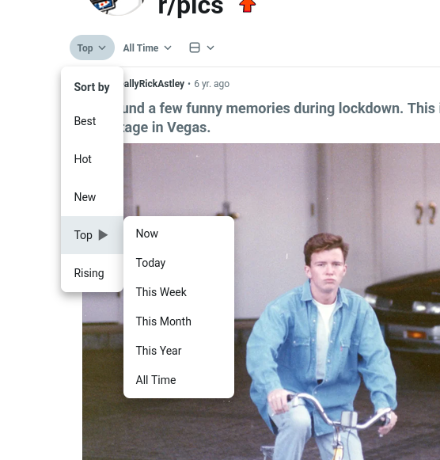

# Reddit Quality of Life Userscript

A Tampermonkey userscript that fixes what reddit's own UI still gets wrong: images open in a real
viewer, comment gifs show a frame instead of a black square, "N more replies" loads where you are,
deep threads stay readable, and the sort menu gets the time ranges it hides.

Install: click [`Reddit-QoL.user.js`](https://github.com/acidnik/reddit-qol/raw/refs/heads/main/Reddit-QoL.user.js) —
Tampermonkey (or Violentmonkey) opens its install dialog.

# Features

## Image viewer

Click any image — in a feed, in a post or in a comment — to open it in a modal: scroll to zoom in
and out, drag to pan while zoomed, `Esc` or a click outside to close, arrow keys and the toolbar
buttons to move through every image of the page. Replaces reddit's built-in lightbox.

▶ demo: open, zoom, pan, next/prev (mp4, 9 s)

<video src="https://github.com/user-attachments/assets/7920ab8c-f8bd-4d2a-abda-1ea29fd9b04b" controls preload="metadata" width="760"></video>

## Comment gifs show a frame instead of a black square

A gif posted in a comment renders as a black square until you press play, so nothing tells you what
it is about. Every gif is pinned to its first frame as soon as it scrolls into view (not earlier — a
comment page must not pull megabytes nobody asked to see) and still plays on click.

▶ demo: before / after (mp4, 16 s + 18 s)

| before | after |
| :---: | :---: |
| <video src="https://github.com/user-attachments/assets/32edc37c-0d24-423d-89a2-368526b4d13b" controls preload="metadata" width="380"></video> | <video src="https://github.com/user-attachments/assets/5a705a11-fe1c-4aa2-a9f6-9ada2c8a1102" controls preload="metadata" width="380"></video> |
| black square until you press play | first frame is there right away |

## Comments load in place — and stay readable at any depth

- A deep "N more replies" fold expands where you are: the link turns into a spinner (the legacy
  subthread page needs a few seconds to render), the replies are grafted into the thread and the
  spent link disappears. No page reload, no losing your place, at any nesting level.
- Reddit indents every reply by 32px, so from about depth 12 the text column is under 250px wide and
  a long argument turns into a sliver of text. Any comment that narrow gets its container pulled
  back to the width and position of a top-level one, so the thread below it starts over with a
  full-width budget — and every ~11 levels further down again.

▶ demo: folds expanding in place, deep threads (mp4, 87 s)

<video src="https://github.com/user-attachments/assets/1d29fa18-e20a-4e7e-95ea-c892d1c3e1f4" controls preload="metadata" width="420"></video>

## Sort by top with a time range

Hovering "Top" in the sort menu expands the time-range submenu (Now / Today / This Week / This
Month / This Year / All); picking a range swaps the feed in place, without a page reload.

## Post author on the home feed

The post author (`u/name`) is shown as a link in the credit bar of every post in the feed.
